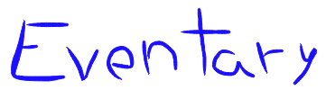

[](https://github.com/alanhoff/node-eventary)
----
[](https://coveralls.io/r/alanhoff/node-eventary)
[](https://travis-ci.org/alanhoff/node-eventary)
[](https://david-dm.org/alanhoff/node-eventary)
[](https://david-dm.org/alanhoff/node-eventary)


Eventary is a little library that helps you to implement powerful event
systems, middleware oriented codes and pluggable/extensible modules.

### Examples

This module works by `hooking` into events and `dispatching` new events to be
hooked by someone else, here a litte demonstration

```javascript
var Eventary = require('eventary');
var events = new Eventary();

// We will listen for 'uppercase' events
events.hook('uppercase', function(event) {

  // Let's transform this data to uppercase
  event.data = event.data.toUpperCase();
});

// Now let's emit some events
events.dispatch('uppercase', 'this is sad because is lowercase.')
  .then(function(data) {

    // Whoooa! Uppercase data! This must be magic!
    console.log(data);
  });
```

But wait, there is more, we can have async hooks too!

```javascript
// With a second argument we tell Eventary
// that this magic is async
events.hook('async', function(event, promise) {

  // Yes, that's right, we use promises to keep the
  // hook chain in order when the magic is async

  setTimeout(function() {
    event.data = event.data.toUpperCase();

    // Hey Eventary, I'm ready with this hook please mode on.
    promise.resolve();
  }, 1000);
});

// Now let's emit some events
events.dispatch('uppercase', 'this is sad because is lowercase.')
  .then(function(data) {

    // Whoooa! Uppercase data! This must be magic!
    console.log(data);
  }).catch(function(err) {

    // Ooops, better call Saul.
    throw err;
  });
```

`"My EventEmitter can do this too."` you would say, so here is an example
implementing `http.Server` with middlewares and highly pluggable events.

```javascript
var Eventary = require('eventary');
var events = new Eventary();
var http = require('http');

// We will listen the main page
events.hook('/', function(event) {

  // We don't need that this event continue to the 404 page
  event.preventDefault();

  // Let's answer this incomming request
  event.data.res.end('Welcome to the main page!');

});

// Listen to '/user/whatever'
events.hook('/user/*', function(event) {

  event.preventDefault();

  // Let's answer this incomming request
  event.data.res.end('We should ask our database for this ' + event.name);
});

// Listen to '/error'
events.hook('/error', function() {
  throw new Error('Something bad happened!');
});

// Listen for EVERY route
events.hook('**', function(event) {

  // Just log it to the stdout
  console.log('HIT - ' + event.name);
});

// Start the server
http.Server(function(req, res) {
  events.dispatch(req.url, {req: req, res: res})
    .then(function() {

      // No one prevented us, sadly this is a 404
      res.statusCode = 404;
      res.end('404 - I don\'t know what you want :-(');

    }).catch(function(err) {

      // We can catch errors!
      res.statusCode = 500;
      res.end('500 - OMG!');
      console.log(err.stack);
    });
}).listen(8080);
```

### Testing

Testing is easy, you need to have `grunt-cli` installed globally, clone this
repository, `npm install` inside the folder and run `grunt test`.

### Todos

* Add comments inline inside [the code](lib/eventary.js).
* Add browser support.
* Write down [the API](api.md).
* Write moar fancy stuff.
* Benchmarks, everyone loves benchmarks!

### License

Copyright (c) 2014, Alan Hoffmeister <alanhoffmeister@gmail.com>

Permission to use, copy, modify, and/or distribute this software for any purpose
with or without fee is hereby granted, provided that the above copyright notice
and this permission notice appear in all copies.

THE SOFTWARE IS PROVIDED "AS IS" AND THE AUTHOR DISCLAIMS ALL WARRANTIES WITH
REGARD TO THIS SOFTWARE INCLUDING ALL IMPLIED WARRANTIES OF MERCHANTABILITY AND
FITNESS. IN NO EVENT SHALL THE AUTHOR BE LIABLE FOR ANY SPECIAL, DIRECT,
INDIRECT, OR CONSEQUENTIAL DAMAGES OR ANY DAMAGES WHATSOEVER RESULTING FROM LOSS
OF USE, DATA OR PROFITS, WHETHER IN AN ACTION OF CONTRACT, NEGLIGENCE OR OTHER
TORTIOUS ACTION, ARISING OUT OF OR IN CONNECTION WITH THE USE OR PERFORMANCE OF
THIS SOFTWARE.


